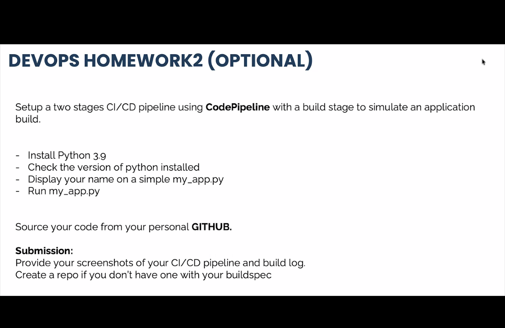
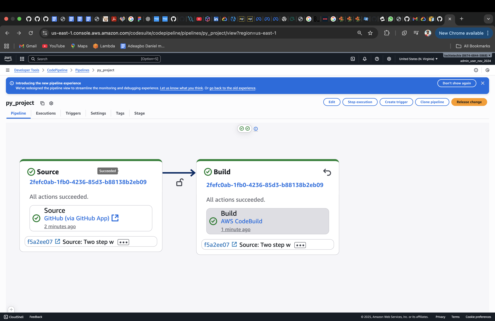
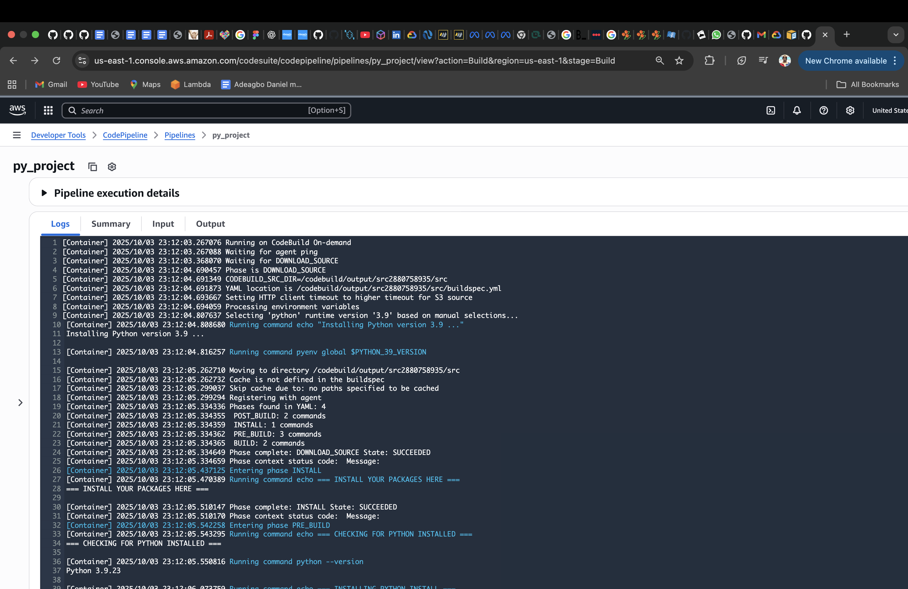
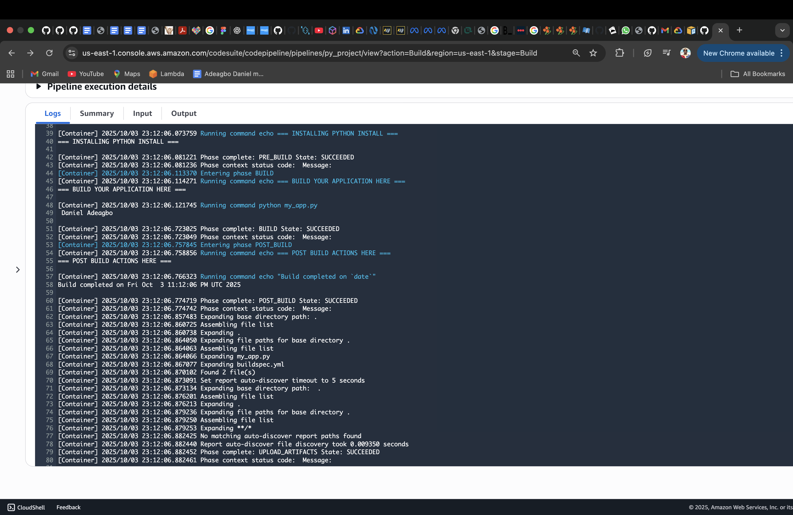

# 2 Stages Code Pipeline Application build HandsOn
This project demonstrates how to set up a simple two-stage CI/CD pipeline using AWS CodePipeline with a build stage in AWS CodeBuild to simulate an application build and execution.

MINI PROJECT 

---
# The pipeline is divided into two stages.  
 # Source Stage
 Fetches the source code from GitHub.
 # Build Stage
 Runs a CodeBuild project that
 Installs Python 3.9
 Checks and displays the Python version
 Runs a Python script `my_app.py` that prints my name

MINI PROJECT 

---

Buildspec Commands Output that shows Python installed, Python Version and Script Showing my name.
### OUTPUTS

